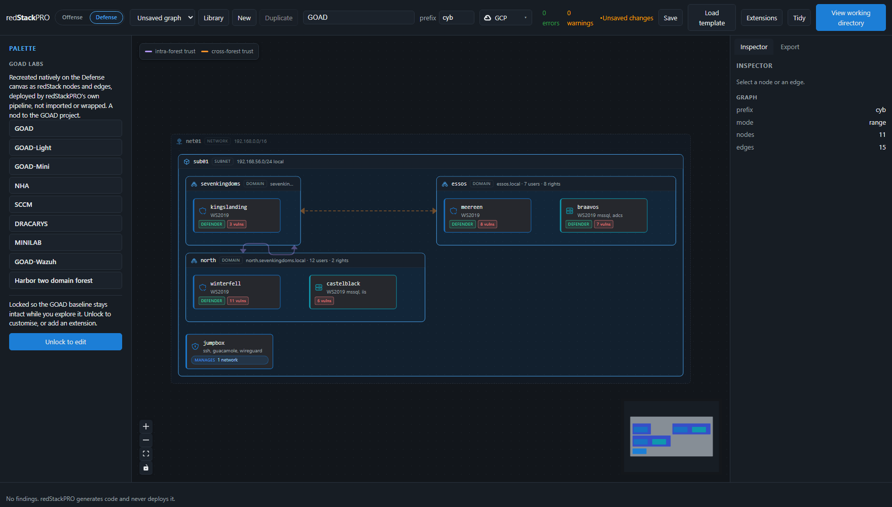

# redStackPRO

Visual composition for red team infrastructure and cyber ranges.

redStackPRO is a web canvas where you build infrastructure as a topology, then
export a complete, runnable working directory of Terraform and Ansible. You run it
from your own machine. redStackPRO never holds your cloud credentials.

Status: pre-release, and the topology schema is still moving. The pipeline itself
works end to end: a topology compiles to Terraform and Ansible, and the export
deploys. GCP and AWS are the supported providers, tested end to end for both
target ranges and attack infrastructure. Azure, Proxmox and ESXi are on the
roadmap: Azure needs a peering module for the attack side, and neither Proxmox
nor ESXi can allocate a public address on its own, so redirector reachability
there depends on a network redStackPRO does not control.

## Run with Docker

The whole canvas in one container -- the API and the web app on one port:

    docker compose up                    # builds from this repo, http://127.0.0.1:8000

Or pull the published image instead of building it:

    docker run -p 8000:8000 -v redstackpro-data:/data \
      ghcr.io/devzero-security/redstackpro:0.9.0

Compose also carries an optional Postgres backend for a shared deployment:

    REDSTACKPRO_DATABASE_URL=postgresql+psycopg://redstackpro:redstackpro@db:5432/redstackpro \
      docker compose --profile postgres up

The image is the composition layer only. It does not carry Terraform or Ansible
and never holds your cloud credentials: you run the export it produces from your
own machine, exactly as in the from-source flow below.

## Run from source

Python 3.11 or newer, and Node 24 for the canvas.

    git clone <this repo> && cd redstackpro
    python -m venv .venv && . .venv/bin/activate
    pip install -e ".[dev]"

**The canvas** is two processes, the API and the web app:

    redstackpro serve                            # http://127.0.0.1:8000
    cd frontend && npm install && npm run dev

Open it, load a template from the library, press Compile, then Download. You get
a zip of the working directory described below.

**Or skip the canvas entirely** and compile a shipped template from the command
line -- same compiler, same output:

    python tools/compile.py frontend/public/goad/goad-light.json -o export

That writes **190 files**: Terraform for the cloud, Ansible for everything that
happens on the boxes, a `deploy.sh`, and a `RANGE-BRIEFING.md` telling you the
credentials and what is planted where. `goad-light` is a two-domain Active
Directory range -- `sevenkingdoms` and `north` across a forest trust, two domain
controllers and a member server, plus a jumpbox.

To deploy it, fill in `export/terraform/terraform.tfvars` and run:

    cd export && bash deploy.sh

`deploy.sh` applies the Terraform and then provisions from the range's own
jumpbox, because the managed hosts sit on a private subnet nothing else can
reach. Your cloud credentials stay on your machine throughout.

## Why

redStack proved the pattern but the topology is fixed in code. redStackPRO makes
it composable, adds multi-provider support, and puts attack infrastructure and
target ranges on the same canvas.

## Docs

- `docs/architecture.md`
- `docs/schema.md`
- `docs/validation.md`
- `docs/solutions/`
- `schema/topology/`

## Checks

CI runs these on every push and pull request. All of them run locally except the
Ansible ones, which need a Linux control node.

    pytest -q                                   the compiler, validator, and API
    python tools/validate.py --hostname <name>  the worked examples
    python tools/check_conventions.py           the house rules in the project conventions
    cd frontend && npm test && npm run build    the canvas

The rest run against a compiled export rather than against the generator,
because a working directory a person unzips and runs is the thing being claimed:

    python tools/compile.py schema/topology/examples/0.4.0/redstack.json --hostname <name> -o export
    terraform -chdir=export/terraform fmt -check -recursive
    terraform -chdir=export/terraform validate
    ansible-playbook -i export/ansible/inventory.yml export/ansible/site.yml --syntax-check
    python tools/check_roles.py export/ansible

`--hostname` is not a flag to work around a broken example. Every shipped example
carrying a redirector arrives one field short on purpose: a redirector is the one
host that answers to the internet by name, a domain has to be registered and
pointed at the box by a human, and nothing can invent one. The validator says so
(RDR001) and the compiler refuses. Pass any domain you control and the tools
fill it the way you would in the canvas inspector before pressing Compile.

`check_roles.py` exists because a syntax check never opens a file reached by
`include_tasks` with a templated name, which is every branch the roles have.

## License

MIT. See LICENSE.

The GOAD range templates under `frontend/public/goad/` are the exception: they are
derived from [GOAD](https://github.com/Orange-Cyberdefense/GOAD) (GPLv3) and are
distributed under GPLv3, with the license and attribution in that directory. They
are data, not code: the canvas loads them as native ranges that compile through
redStackPRO's own terraform and ansible. The rest of the project is MIT.

A devZero Security LLC project.
