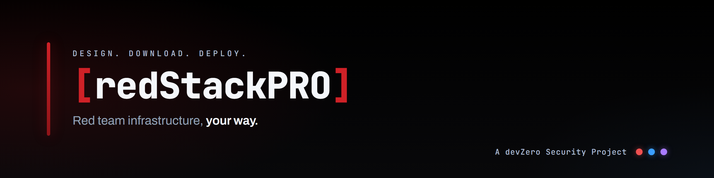
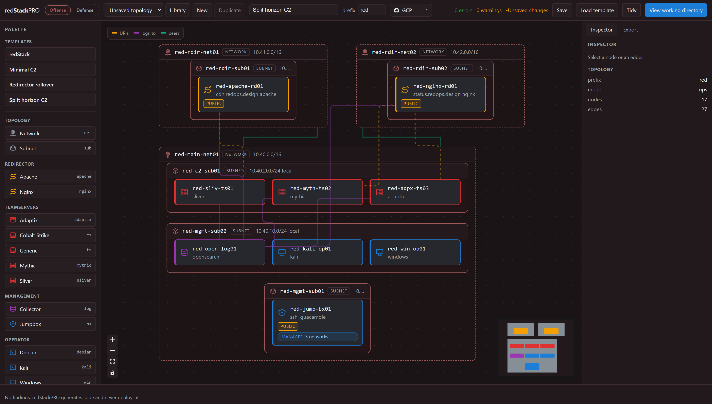
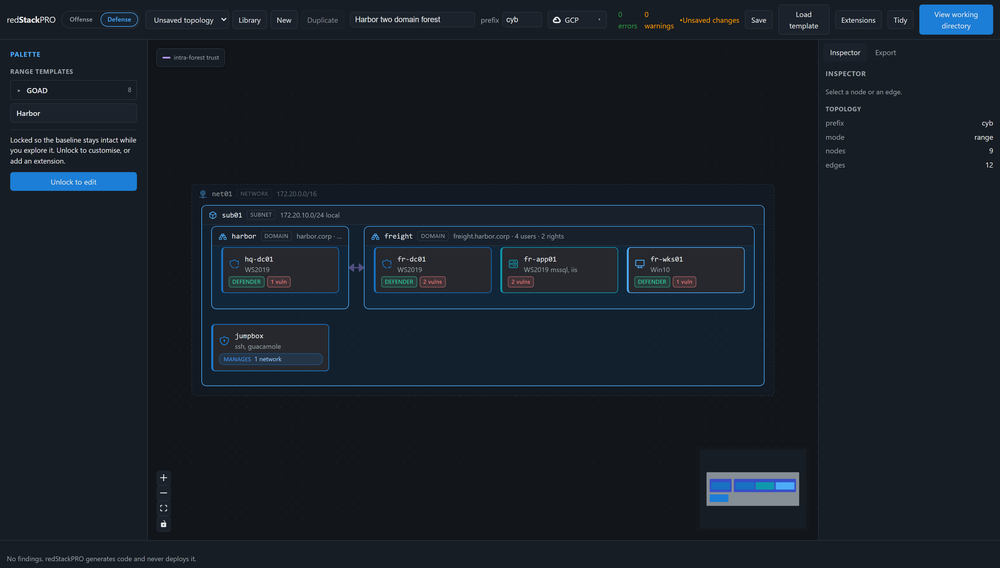
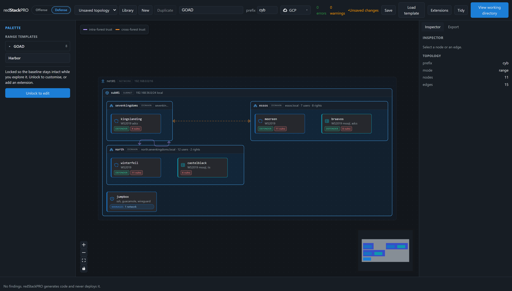

<!-- markdownlint-disable MD033 MD041 -->

  
  
  
  
  

# redStackPRO

> A web canvas where you build infrastructure as a topology, then export a
> complete, runnable working directory of Terraform and Ansible. You run it from
> your own machine. **redStackPRO never holds your cloud credentials.**

> [!IMPORTANT]
> **redStackPRO is in prerelease (beta).** Features are still moving before 1.0.
> GCP and AWS are tested end to end; Azure, Proxmox, and ESXi are on the roadmap.
> Expect rough edges, and pin to a released version if you need stability.
>
> **Hit a rough edge, or have feedback?** Open an issue at
> [Issues](https://github.com/devZero-Security/redStackPRO/issues/new/choose). If it was a
> deploy, attach the scrubbed `logs/deploy-*.log` the run wrote (it records versions,
> provider, and where it stopped, with secrets removed) so it can be analyzed fast. Your
> reports shape the release.

redStackPRO puts attack infrastructure and target ranges on the same canvas. The two
canvas modes are **Offense** (attack infrastructure) and **Defense** (defensive AD ranges); the
export names its handoff `OFFENSE-BRIEFING.md` or `DEFENSE-BRIEFING.md` to match.

Split horizon C2, attack infrastructure: two front doors that do not share a fate,
Apache fronting Sliver and Nginx fronting Mythic, each redirector on its own peered
network, with the teamservers, collector, and operators behind a jumpbox.

**Multiple operators, one stack.** An attack-infrastructure jumpbox can name a
list of `operators` (handle plus role), and each gets a Guacamole portal login
on the shared lab password. Set the jumpbox's `access_mode` to `wireguard` or
`openvpn` (default is a public portal) and every operator also gets a personal
VPN credential generated on the jumpbox at apply: the keys never leave the box
or enter the export, only the client config file does. The portal logins today
share the one lab password, so per-operator isolation comes from each operator's
own VPN credential, not the portal login; individual portal passwords are on the
roadmap. On a VPN access mode the portal closes to the internet and moves behind
the tunnel, while SSH stays open so the admin can keep deploying and managing the
box. Add or remove a teammate on a running jumpbox with
`sudo rsp-operator add <handle>`. See the
wiki [Deploying a Range](https://github.com/devZero-Security/redStackPRO/wiki/Deploying-a-Range).

Harbor, a target range: a small corporate forest, a root domain and a child over a
parent-child trust, with the ordinary path from a phished workstation to the forest.

GOAD, the full lab: three domains across two forests, five machines and their trusts,
the reference range the written solution follows.

> [!IMPORTANT]
> **The export is the boundary.** The canvas generates files; you run them under
> your own credentials. redStackPRO never deploys anything and never holds a secret.

> [!CAUTION]
> **Authorized use only.** redStackPRO builds offensive infrastructure and
> deliberately vulnerable ranges. Use it only in lab environments you own or are
> explicitly authorized to test, never against systems you do not have written
> permission for.

---

## 🧭 Status

Pre-release, with more to come before 1.0. The pipeline itself works end
to end: a topology compiles to Terraform and Ansible, and the export deploys.

| Provider | State |
| -------- | ----- |
| GCP, AWS | Supported and tested end to end, for both target ranges and attack infrastructure. |
| Azure, Proxmox, ESXi | On the roadmap, not yet supported. |

---

## 🐳 Run with Docker

The whole canvas in one container, the API and the web app on one port:

    docker compose up                    # builds from this repo, http://127.0.0.1:8000

Or pull the published image instead of building it:

    docker run -p 8000:8000 -v redstackpro-data:/data \
      ghcr.io/devzero-security/redstackpro:0.9.1

The canvas listens on 8000 inside the container. To serve it on a different host
port, change the left half of the mapping (`-p 8787:8000`), or set
`REDSTACKPRO_PORT` for compose (`REDSTACKPRO_PORT=8787 docker compose up`).

Compose also carries an optional Postgres backend for a shared deployment:

    REDSTACKPRO_DATABASE_URL=postgresql+psycopg://redstackpro:redstackpro@db:5432/redstackpro \
      docker compose --profile postgres up

The image is the composition layer only. It does not carry Terraform or Ansible
and never holds your cloud credentials: you run the export it produces from your
own machine, exactly as in the from-source flow below.

---

## ⚙️ Run from source

Python 3.11 or newer, and Node 24 for the canvas.

    git clone <this repo> && cd redStackPRO
    python -m venv .venv && . .venv/bin/activate
    pip install -e ".[dev]"

**The canvas** is two processes, the API and the web app:

    redstackpro serve                            # http://127.0.0.1:8000
    cd frontend && npm install && npm run dev

`redstackpro serve --port 8787` moves the API to a different port. Point the
canvas dev server at it with `REDSTACKPRO_API=http://127.0.0.1:8787`.

Open it, use **Load blueprint** (the button, or the mode palette) to open a
shipped starting point, choose your cloud in the toolbar
provider selector (GCP or AWS), open the Export tab (it compiles as you go), then
Download. You get a zip of the working directory described below.

**Or skip the canvas entirely** and compile a shipped blueprint from the command
line, same compiler, same output:

    redstackpro compile frontend/public/goad/goad-light.json -o export

The command line defaults to GCP. Pass `--provider aws` for AWS.

That writes about **200 files**: Terraform for the cloud, Ansible for everything
that happens on the boxes, a `deploy.sh`, and a `DEFENSE-BRIEFING.md` telling you the
credentials and what is planted where. `goad-light` is a two-domain Active
Directory range: `sevenkingdoms` and its child `north`, a parent-child trust in
one forest, two domain controllers and a member server, plus a jumpbox.

> [!IMPORTANT]
> **Two things before you deploy.** Your cloud identity needs permission to
> create the resources the export builds (VPCs or networks, subnets, security
> groups or firewall rules, instances, elastic or static IPs), and your machine
> needs `terraform`, `ssh`, `tar`, and Python 3.8 or newer. redStackPRO generates
> the code and installs none of that for you; Ansible installs itself on the
> jumpbox.
>
> New to the AWS CLI or gcloud? Quick setup for whichever you target:
>
> **AWS**
>
>     aws configure
>     aws sts get-caller-identity
>
> Attach the `AmazonEC2FullAccess` managed policy to the IAM user or role you
> configure.
>
> **GCP**
>
>     gcloud auth login
>     gcloud auth application-default login
>     gcloud config set project <project-id>
>     gcloud services enable compute.googleapis.com --project <project-id>
>
> Grant your account `roles/compute.admin` on the project.
>
> Full permission tables, install links, and the GCP vCPU quota note
> (`CPUS_ALL_REGIONS`, default 32 per project) are in the wiki
> [Cloud Prerequisites](https://github.com/devZero-Security/redStackPRO/wiki/Cloud-Prerequisites).
> See [Getting Started](https://github.com/devZero-Security/redStackPRO/wiki/Getting-Started)
> for the full checklist.

To deploy it, fill in `export/deploy.tfvars` (at the export root) and run:

    cd export && bash deploy.sh

`deploy.sh` copies `deploy.tfvars` into `terraform/terraform.tfvars` at apply
time and aborts if `deploy.tfvars` is missing, so edit the root file, not the
one under `terraform/`.

On Windows, run `.\deploy.ps1` instead: `bash deploy.sh` at a PowerShell prompt
launches WSL, a different filesystem with different credentials. See the wiki
[Deploying a Range](https://github.com/devZero-Security/redStackPRO/wiki/Deploying-a-Range)
for detail.

`deploy.sh` applies the Terraform and then provisions from the range's own
jumpbox, because the managed hosts sit on a private subnet nothing else can
reach. Your cloud credentials stay on your machine throughout.

Every run writes a timestamped, secret-scrubbed log to
`logs/deploy-<timestamp>.log` in the export. If a deploy fails or a range
comes up wrong, attach the newest one to a GitHub issue; `deploy.sh` prints
its path and a link when something goes wrong.

**Check it worked.** The export ships `verify.py` next to `deploy.sh`. Run it
against the deployed range to confirm the path end to end:

    python verify.py doors .     # redirector front doors, from outside
    python verify.py stack .     # the range over SSH from the jumpbox

Each exits 0 when every check passes. On an offense range, the generated
`OFFENSE-BRIEFING.md` holds the C2 payload recipe (callback domain, URI prefix,
and gating header per redirector), and `sudo rsp-check` on a redirector checks
the same path from the box itself.

**Manage and tear down.** The export also ships lifecycle scripts, `manage.sh`
(and `manage.ps1` on Windows), for the running range. They take `status`,
`start`, `stop`, and `teardown`: `stop` pauses billing without destroying the
range, and `teardown` destroys it.

    ./manage.sh status
    ./manage.sh start
    ./manage.sh stop
    ./manage.sh teardown

---

## ☁️ Plan AWS quotas per region

AWS quotas are per region, and a compile does not check them. Scope them before a
large or concurrent deploy, so an apply does not fail partway and leave
infrastructure running and billing.

- **Elastic IPs.** The default is 5 per region. A defense/AD range uses about 2
  (jumpbox plus NAT gateway), an offense range about 3 (jumpbox, redirector, NAT
  gateway), so the default holds only one or two concurrent ranges. Request an
  increase per region in advance. An EIP shortfall surfaces at provisioning, after
  the instances are up, so a failed apply leaves them running to be destroyed.
- **vCPUs.** The running On-Demand standard vCPU limit caps a region. Hosts are
  mostly `t3.large` and `t3.medium` (2 vCPU each), and a full AD range (GOAD plus a
  SIEM) can exceed the default. Check and raise it before large deploys.
- **Kali subscription.** A Kali operator needs a one-time Marketplace subscription
  on the account, per region. redStackPRO generates code and touches no account, so
  you subscribe once per region you deploy Kali into.

All of this is per region. Running several ranges at once? Give each a distinct
**prefix** so its host names stay clear; the few account-global names (the key pair
and the auto-stop role) auto-suffix per deployment, so ranges never collide in one
account. The full quota table, the increase commands, and the pre-deploy checklist
are in the wiki:
[Providers](https://github.com/devZero-Security/redStackPRO/wiki/Providers) and
[Deploying a Range](https://github.com/devZero-Security/redStackPRO/wiki/Deploying-a-Range).

---

## 🤖 API and agents

Everything the canvas does is available headless, so an agent can operate
redStackPRO without a person clicking through it. A topology is plain JSON against
a published schema (`src/redstackpro/schema/topology/`, also served at `/api/v1/registry/schema`),
the registry endpoints report the vocabulary of node kinds, providers, and roles,
and the validate and compile steps the canvas calls are the same REST endpoints.
The API is documented at `/docs` and `/openapi.json`, which a model can read as
tools.

    redstackpro serve                                  # http://127.0.0.1:8000
    curl 127.0.0.1:8000/api/v1/registry/schema         # the topology schema
    curl -X POST 127.0.0.1:8000/api/v1/validate \
      -H 'content-type: application/json' \
      -d '{"document": {...topology...}, "provider": "gcp"}'
    curl -X POST 127.0.0.1:8000/api/v1/compile \
      -H 'content-type: application/json' \
      -d '{"document": {...topology...}, "provider": "gcp"}'

Validation returns structured findings, each with a stable `code`, the target,
prose and a remedy, and the compiler refuses a document with errors and hands back
those same findings. The loop is read the schema, compose a topology, validate,
fix what the findings name, compile. A model iterates on the outcome rather than
scraping prose, and the validate call stores nothing along the way. The command
line is the same pipeline for a shell agent, `redstackpro validate` and
`redstackpro compile`.

The running instance trusts the local caller, which suits a single-user or
self-hosted deployment. Authenticated, multi-tenant agentic access over the API
is part of the enterprise edition. redStackPRO holds no cloud credentials on any
path: the export is the handoff, and you run it yourself.

---

## 💡 Why

redStack proved the pattern but the topology is fixed in code. redStackPRO makes
it composable, adds multi-provider support, and puts attack infrastructure and
target ranges on the same canvas.

---

## 📚 Docs

- [docs/architecture.md](docs/architecture.md)
- [docs/schema.md](docs/schema.md)
- [docs/validation.md](docs/validation.md)
- [docs/solutions/](docs/solutions/)
- [src/redstackpro/schema/topology/](src/redstackpro/schema/topology/)

---

## 🗂️ Repo layout

    src/                     the Python package and everything it ships
      redstackpro/           the composition layer: validator, compiler, API
        schema/              the document schema, registry data, worked examples
        tools/               command line tools (compile, validate, dev tooling)
        assets/              Ansible roles and static files baked into the export
    frontend/                the web canvas (Vite + React)
    tests/                   the suite: compiler, validator, API, export
    docs/                    architecture, schema, validation, solutions, images
    pyproject.toml           package metadata, deps, and the console entry points
    alembic.ini              migration config for the Postgres backend
    Dockerfile               the one-container build (API plus built canvas)
    docker-compose.yml       local run, with an optional Postgres profile
    .dockerignore            build context trim
    README.md                this file
    LICENSE                  MIT, with the GOAD templates under GPLv3
    .github/                 CI workflows

---

## License

MIT. See LICENSE.

The GOAD range templates under `frontend/public/goad/` are the exception: they are
derived from [GOAD](https://github.com/Orange-Cyberdefense/GOAD) (GPLv3) and are
distributed under GPLv3, with the license and attribution in that directory. They
are data, not code: the canvas loads them as native ranges that compile through
redStackPRO's own terraform and ansible. The rest of the project is MIT.

A devZero Security Project.
